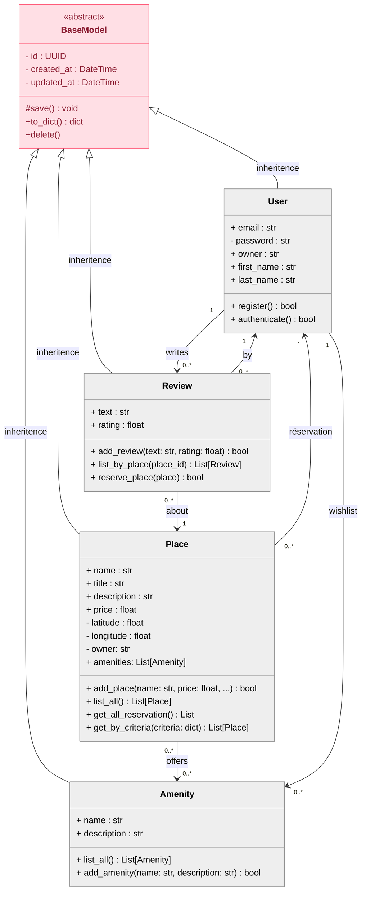

```mermaid
classDiagram
direction TB
    class BaseModel {
	    - id : UUID
	    - created_at : DateTime
	    - updated_at : DateTime
	    #save() void
	    +to_dict() dict
		+delete()
    }

    class Review {
	    + text : str
	    + rating : float
		+ add_review(text: str, rating: float) bool
	    + list_by_place(place_id) List[Review]
		+ reserve_place(place)  bool
    }

    class Amenity {
	    + name : str
	    + description : str
	    + list_all() List[Amenity]
		+ add_amenity(name: str, description: str)  bool
    }

    class Place {
	    + name : str
		+ title : str
	    + description : str
	    + price : float
	    - latitude : float
	    - longitude : float
	    - owner: str
	    + amenities: List[Amenity]
		+ add_place(name: str, price: float, ...)  bool
	    + list_all() List[Place]
		+ get_all_reservation() List
        + get_by_criteria(criteria: dict) List[Place]
    }

    class User {

	    + email : str
	    - password : str
		+ owner : str
	    + first_name : str
	    + last_name : str
	    + register() bool
	    + authenticate() bool
		}

	<<abstract>> BaseModel

    BaseModel <|-- User : inheritence
    BaseModel <|--  Place : inheritence
    BaseModel <|--  Review : inheritence
    BaseModel <|--  Amenity : inheritence
    
	Review "0..*" --> "1" Place : about
	Review "0..*" --> "1" User : by

    Place "0..*" --> "0..*" Amenity : offers
	
    User "1" <-- "0..*" Place : réservation
    User "1" --> "0..*" Review : writes
    User "1" --> "0..*" Amenity : wishlist

	style BaseModel :,stroke-width:1px,stroke-dasharray:none,stroke:#FF5978,fill:#FFDFE5,color:#8E2236
	style Review :,stroke-width:1px,stroke-dasharray:none,stroke:#999999,fill:#EEEEEE,color:#000000
	style Amenity :,stroke-width:1px,stroke-dasharray:none,stroke:#999999,fill:#EEEEEE,color:#000000
	style Place :,stroke-width:1px,stroke-dasharray:none,stroke:#999999,fill:#EEEEEE,color:#000000
	style User :,stroke-width:1px,stroke-dasharray:none,stroke:#999999,fill:#EEEEEE,color:#000000

	class BaseModel:::Rose
	class Review:::Ash
	class Amenity:::Ash
	class Place:::Ash
	class User:::Ash
```
