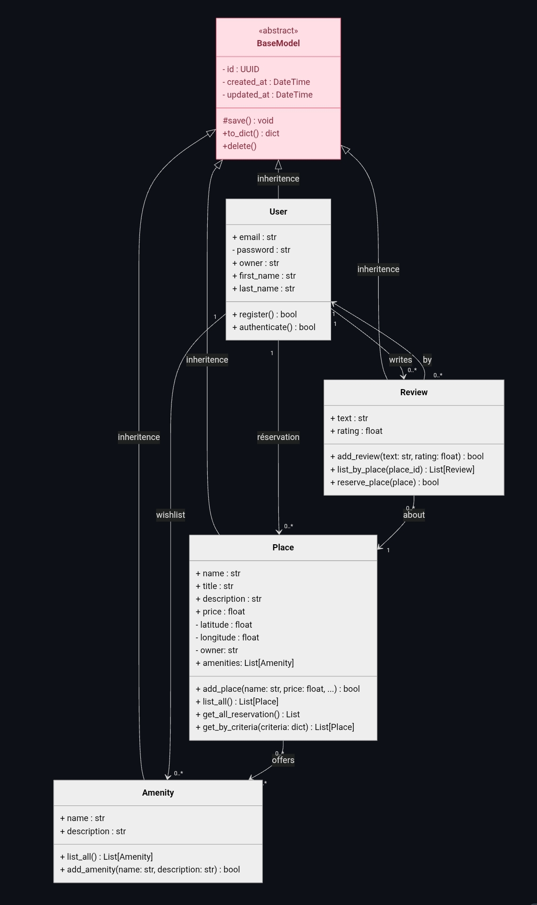
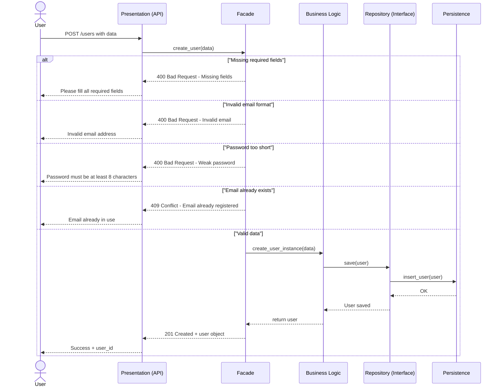
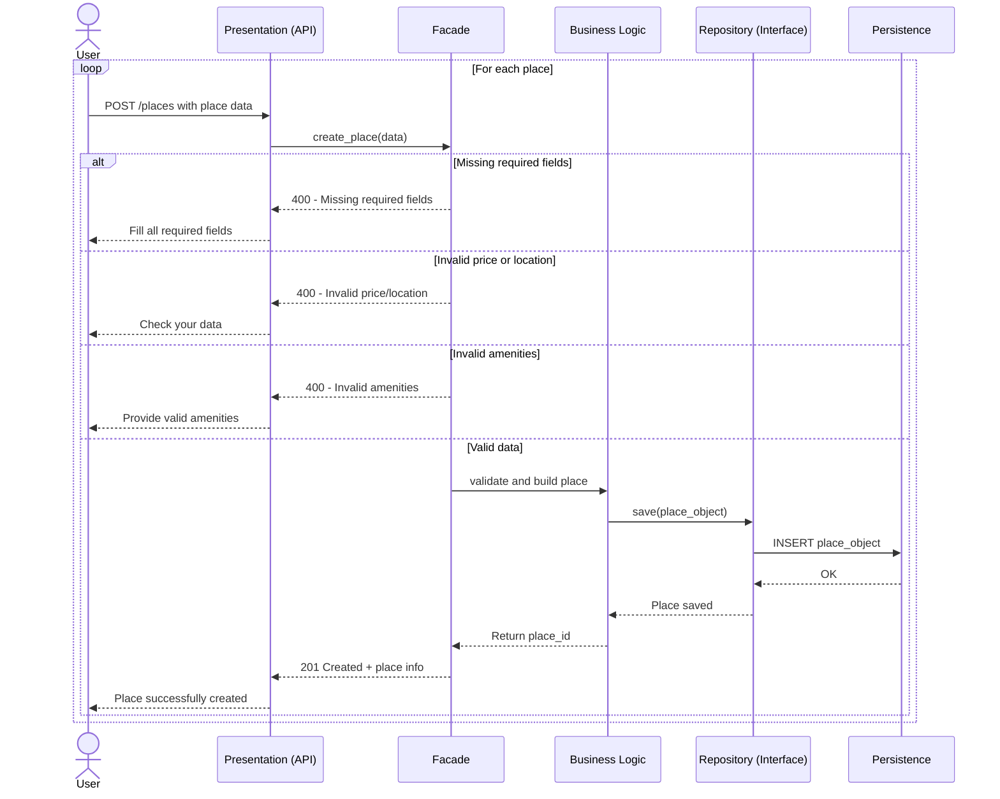
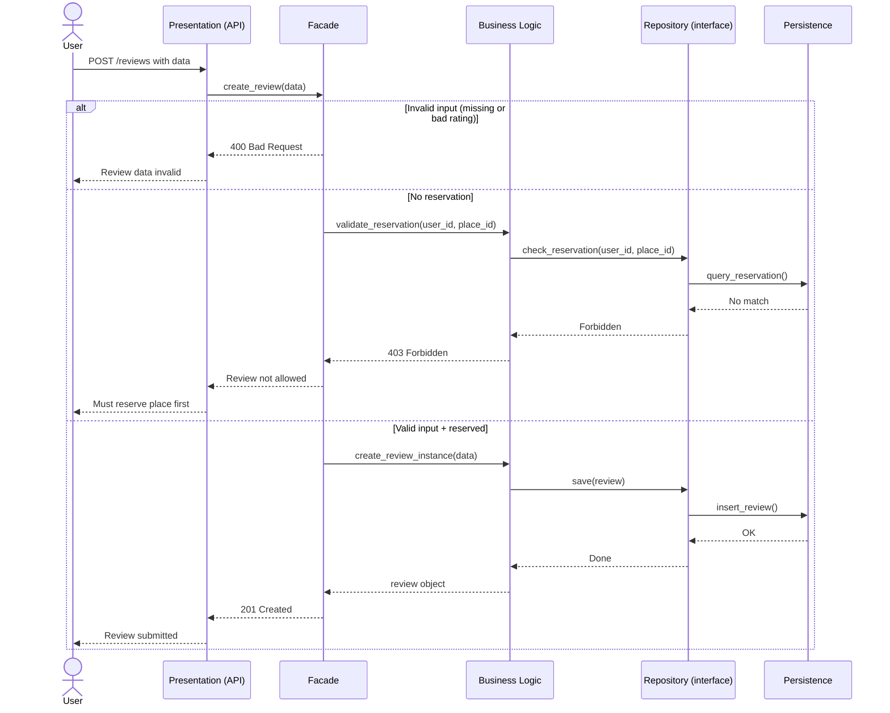

# HBNB UML Diagrams - Technical Documentation

<p align="center">
  
</p>


This repository contains the technical documentation and UML diagrams for the **HBNB project** — part of the Holberton School AirBnB clone. It compiles all architectural and design diagrams into a cohesive reference blueprint for the project’s implementation.

---

## Table of Contents

- [Introduction](#introduction)
- [High-Level Package Diagram](#high-level-package-diagram)
- [Class Diagram for Business Logic Layer](#class-diagram-for-business-logic-layer)
- [Sequence Diagrams for API Calls](#sequence-diagrams-for-api-calls)
- [Explanatory Notes](#explanatory-notes)
- [Status](#status)
- [How to Use](#how-to-use)
- [Author](#author)
- [License](#license)

---

## Introduction

This document serves as a **comprehensive technical reference** for the HBNB system — the backend foundation of the Holberton School AirBnB clone project. It consolidates all key UML diagrams into a single, structured blueprint, offering a clear overview of the system’s architecture and internal workflows.

### Purpose

- Provide **visual and written representations** of the system’s layered architecture and object relationships.
- Clarify **design choices** and their underlying rationale, making the codebase easier to understand, maintain, and extend.
- Serve as a **reliable reference** for developers during all phases of the project, including planning, implementation, testing, and review.

---

## High-Level Package Diagram


### Description

- **Layered Structure:**
  - **Presentation Layer:** Handles user interaction and routing.
  - **Business Logic Layer:** Contains core application logic.
  - **Data Layer:** Manages storage and persistence.

- **Facade Pattern:** Used to simplify interactions between layers and reduce coupling.

---

## Class Diagram for Business Logic Layer



### Description

- Main entities:
  - `User`
  - `Place`
  - `Amenity`
  - `Review`

- Relationships:
  - `User` → `Place` : owns (1 → *)
  - `Place` → `Amenity` : offers (* → *)
  - `Place` → `Review` : receives (* → *)
  - `User` → `Review` : writes (1 → *)

- Each class is described with:
  - Attributes (e.g., `name`, `description`, `created_at`, etc.)
  - Responsibilities
  - Relationship roles

### Diagram Legend (Related to Class Diagram)

To interpret the UML class diagrams, here’s a quick legend for the **relationship arrows**:

| Symbol / Notation        | Description                                                                                |
|--------------------------|--------------------------------------------------------------------------------------------|
| `1 → *`                  | One-to-Many relationship (e.g., one `User` owns many `Places`).                            |
| `* → *`                  | Many-to-Many relationship (e.g., a `Place` offers multiple `Amenities`, and vice versa).   |
| `1 → 1`                  | One-to-One relationship.                                                                   |
| `0 → 1`                  | Optional relationship (zero or one).                                                       |
| `0 → *`                  | Optional One-to-Many (e.g., an entity may have zero or more related items).                |
| ➝ (Solid Arrow)          | Association (basic link between classes).                                                  |
| ◆ (Empty Diamond)        | Aggregation (shared ownership; lifetime of contained object is independent).               |
| ◼︎ (Filled Diamond)       | Composition (strong ownership; if the container is destroyed, so is the contained object). |
| △ (Triangle Arrow)       | Inheritance / Generalization (one class inherits from another).                            |

## Sequence Diagram for API CAlls

Below are Mermaid.js-based sequence diagrams representing core API workflows.

User Registration :



Place Creation :



Review Submission :



## Legend - UML Sequence Diagram 

| Symbol                    | Meaning                                                                    |
|---------------------------|----------------------------------------------------------------------------|
| Actor                     | External entity (e.g., user) that interacts with the system.               |
| `->`                      | Synchronous message or method call.                                        |
| `-->`                     | Asynchronous message.                                                      |
| `-->>` or dashed arrow    | Return message or response.                                                |
| `alt` / `opt` / `loop`    | Control blocks: alternative, optional, or loop.                            |
| `activate` / `deactivate` | Object's activation bar (lifeline emphasis).                               |
| Lifeline (vertical line)  | Represents the lifespan of a participant during the interaction.           |
---

##  Status

-  Diagrams created and reviewed
-  Organized and documented in Markdown
-  Ready to be included in the main AirBnB clone documentation or wiki

---

##  How to Use

1. Clone the repository: https://github.com/Ravou/holbertonschool-hbnb.git

2. Open the diagram files using your prefered UML viewer or any web browser.

3. Use the diagrams for documentation, development guidance, or team onboarding.

##  Author

- Olivia Letchy - https://github.com/Ravou

##  License

```
This project is licensed under the MIT License. 

You are free to use, copy, modify, merge, publish, distribute, sublicense, and/or sell copies of the Software, provided that the original license notice is included in all copies or substantial portions of the Software.

> Copyright (c) 2025 Ravou  
>  
> THE SOFTWARE IS PROVIDED "AS IS", WITHOUT WARRANTY OF ANY KIND, EXPRESS OR IMPLIED, INCLUDING BUT NOT LIMITED TO THE WARRANTIES OF MERCHANTABILITY, FITNESS FOR A PARTICULAR PURPOSE AND NONINFRINGEMENT.

