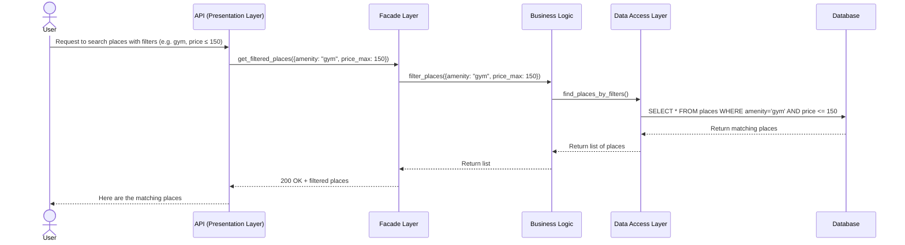

```mermaid
sequenceDiagram
    %% Layers:
    %% Presentation: User, API
    %% Business Logic: Facade, BusinessLogic, Repository
    %% Persistence: Database

    actor User
    participant API as API (Presentation Layer)
    participant Facade as Facade Layer
    participant BusinessLogic as Business Logic
    participant Repository as Data Access Layer
    participant Persistence as Database

    User ->> API: Request to search places with filters (e.g. gym, price ≤ 150)
    API ->> Facade: get_filtered_places({amenity: "gym", price_max: 150})
    Facade ->> BusinessLogic: filter_places({amenity: "gym", price_max: 150})
    BusinessLogic ->> Repository: find_places_by_filters()
    Repository ->> Persistence: SELECT * FROM places WHERE amenity='gym' AND price <= 150
    Persistence -->> Repository: Return matching places
    Repository -->> BusinessLogic: Return list of places
    BusinessLogic -->> Facade: Return list
    Facade -->> API: 200 OK + filtered places
    API -->> User: Here are the matching places
```
