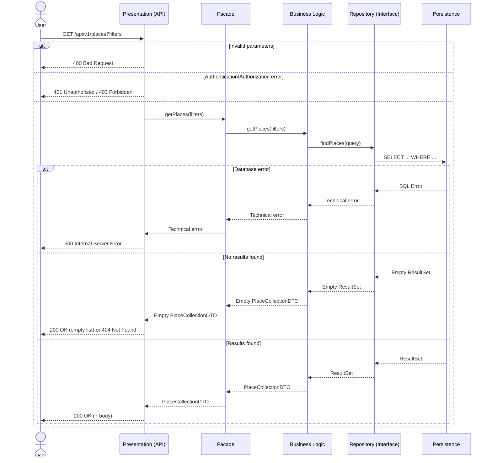

```mermaid
sequenceDiagram
    actor User as User
    participant API as Presentation (API)
    participant Facade as Facade
    participant BusinessLogic as Business Logic
    participant Repository as Repository (Interface)
    participant Database as Persistence

    User->>API: GET /api/v1/places?filters

    alt Invalid parameters
        API-->>User: 400 Bad Request
    else Authentication/Authorization error
        API-->>User: 401 Unauthorized / 403 Forbidden
    else
        API->>Facade: getPlaces(filters)
        Facade->>BusinessLogic: getPlaces(filters)
        BusinessLogic->>Repository: findPlaces(query)
        Repository->>Database: SELECT ... WHERE ...
        alt Database error
            Database-->>Repository: SQL Error
            Repository-->>BusinessLogic: Technical error
            BusinessLogic-->>Facade: Technical error
            Facade-->>API: Technical error
            API-->>User: 500 Internal Server Error
        else No results found
            Database-->>Repository: Empty ResultSet
            Repository-->>BusinessLogic: Empty ResultSet
            BusinessLogic-->>Facade: Empty PlaceCollectionDTO
            Facade-->>API: Empty PlaceCollectionDTO
            API-->>User: 200 OK (empty list) or 404 Not Found
        else Results found
            Database-->>Repository: ResultSet
            Repository-->>BusinessLogic: ResultSet
            BusinessLogic-->>Facade: PlaceCollectionDTO
            Facade-->>API: PlaceCollectionDTO
            API-->>User: 200 OK (+ body)
        end
    end
```
