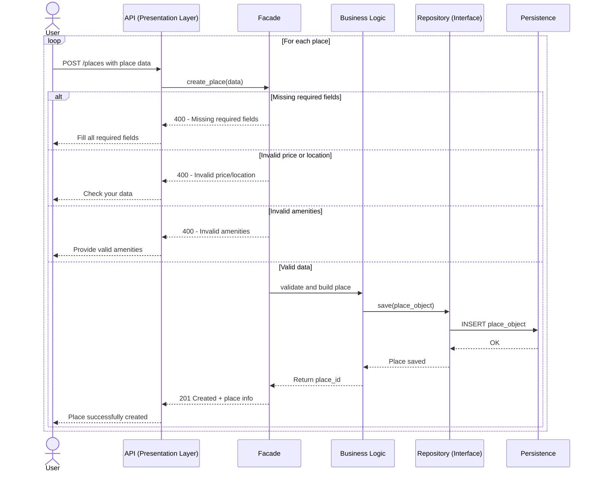

```mermaid
sequenceDiagram
    %% Layers:
    %% Presentation: User, API
    %% Business Logic: Facade, PlaceLogic, PlaceRepository
    %% Persistence: Database

    actor User
    participant API as API (Presentation Layer)
    participant Facade as Facade
    participant PlaceLogic as Business Logic
    participant PlaceRepository as Repository (Interface)
    participant Database as Persistence

    loop For each place
        User ->> API: POST /places with place data
        API ->> Facade: create_place(data)

        alt Missing required fields
            Facade -->> API: 400 - Missing required fields
            API -->> User: Fill all required fields
        else Invalid price or location
            Facade -->> API: 400 - Invalid price/location
            API -->> User: Check your data
        else Invalid amenities
            Facade -->> API: 400 - Invalid amenities
            API -->> User: Provide valid amenities
        else Valid data
            Facade ->> PlaceLogic: validate and build place
            PlaceLogic ->> PlaceRepository: save(place_object)
            PlaceRepository ->> Database: INSERT place_object
            Database -->> PlaceRepository: OK
            PlaceRepository -->> PlaceLogic: Place saved
            PlaceLogic -->> Facade: Return place_id
            Facade -->> API: 201 Created + place info
            API -->> User: Place successfully created
        end
    end
```
