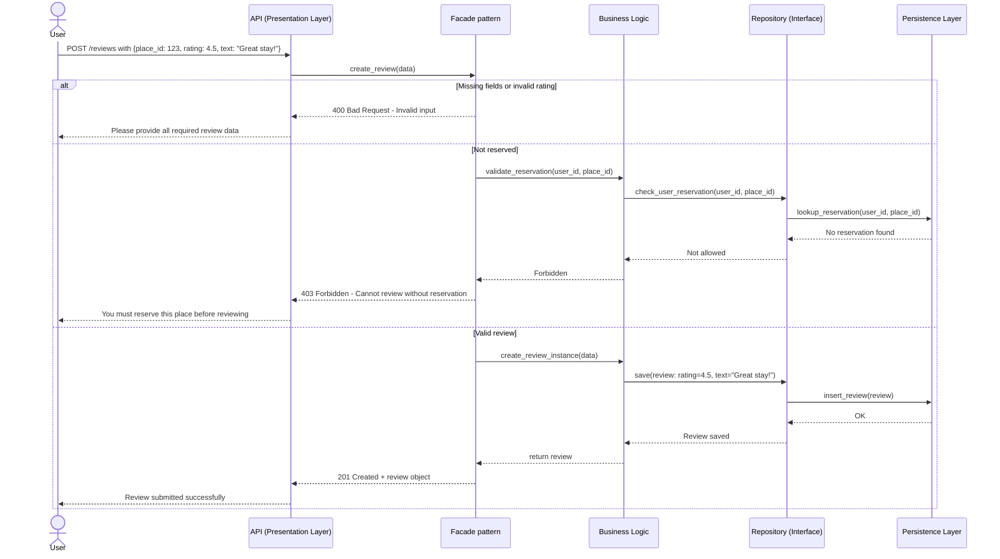

```mermaid
sequenceDiagram
    %% Layers:
    %% Presentation: User, API
    %% Business Logic: Facade, BusinessLogic, Repository
    %% Persistence: Persistence

    actor User
    participant API as API (Presentation Layer)
    participant Facade as Facade pattern
    participant BusinessLogic as Business Logic
    participant Repository as Repository (Interface)
    participant Persistence as Persistence Layer

    User ->> API: POST /reviews with {place_id: 123, rating: 4.5, text: "Great stay!"}
    API ->> Facade: create_review(data)

    alt Missing fields or invalid rating
        Facade -->> API: 400 Bad Request - Invalid input
        API -->> User: Please provide all required review data
    else Not reserved
        Facade ->> BusinessLogic: validate_reservation(user_id, place_id)
        BusinessLogic ->> Repository: check_user_reservation(user_id, place_id)
        Repository ->> Persistence: lookup_reservation(user_id, place_id)
        Persistence -->> Repository: No reservation found
        Repository -->> BusinessLogic: Not allowed
        BusinessLogic -->> Facade: Forbidden
        Facade -->> API: 403 Forbidden - Cannot review without reservation
        API -->> User: You must reserve this place before reviewing
    else Valid review
        Facade ->> BusinessLogic: create_review_instance(data)
        BusinessLogic ->> Repository: save(review: rating=4.5, text="Great stay!")
        Repository ->> Persistence: insert_review(review)
        Persistence -->> Repository: OK
        Repository -->> BusinessLogic: Review saved
        BusinessLogic -->> Facade: return review
        Facade -->> API: 201 Created + review object
        API -->> User: Review submitted successfully
    end


```
