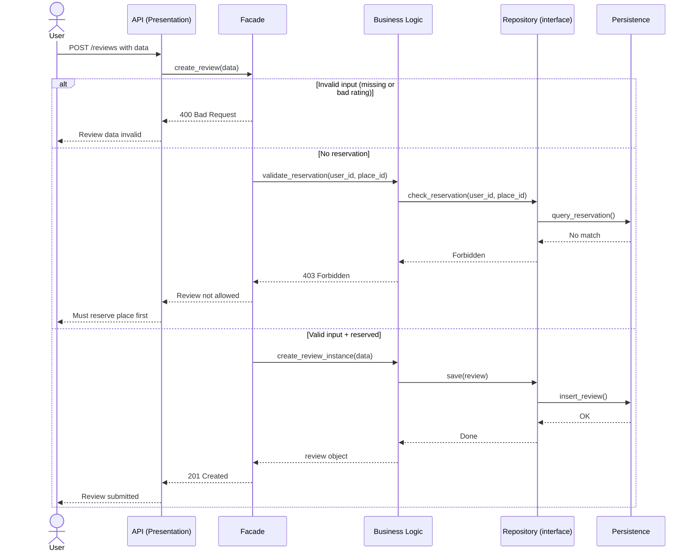

```mermaid
sequenceDiagram
    actor User
    participant API as API (Presentation)
    participant Facade
    participant Logic as Business Logic
    participant Repo as Repository (interface)
    participant DB as Persistence

    User ->> API: POST /reviews with data
    API ->> Facade: create_review(data)

    alt Invalid input (missing or bad rating)
        Facade -->> API: 400 Bad Request
        API -->> User: Review data invalid
    else No reservation
        Facade ->> Logic: validate_reservation(user_id, place_id)
        Logic ->> Repo: check_reservation(user_id, place_id)
        Repo ->> DB: query_reservation()
        DB -->> Repo: No match
        Repo -->> Logic: Forbidden
        Logic -->> Facade: 403 Forbidden
        Facade -->> API: Review not allowed
        API -->> User: Must reserve place first
    else Valid input + reserved
        Facade ->> Logic: create_review_instance(data)
        Logic ->> Repo: save(review)
        Repo ->> DB: insert_review()
        DB -->> Repo: OK
        Repo -->> Logic: Done
        Logic -->> Facade: review object
        Facade -->> API: 201 Created
        API -->> User: Review submitted
    end
```
