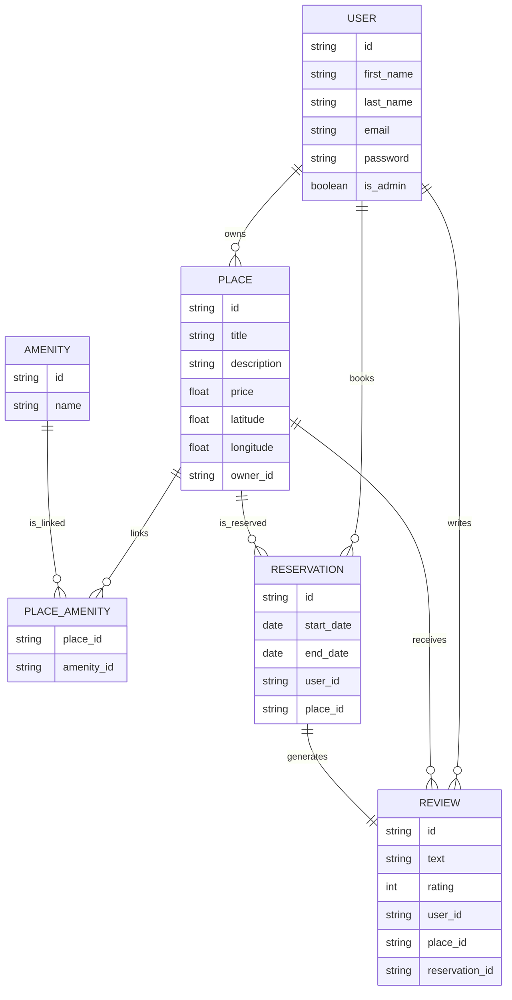

<div align="center">
  <h1>HBnB Project - Part 3: Enhanced Backend with Authentication and Database Integration</h1>
  
</div>


## Table of Contents

- [Overview](#overview)
- [Objectives](#objectives)
- [Learning Outcomes](#learning-outcomes)
- [Project Context](#project-context)
- [Project Structure and Key Tasks](#project-structure-and-key-tasks)
- [Technologies and Libraries Used](#technologies-and-libraries-used)
- [How to Run](#how-to-run)
- [Example](#example)
- [ER Diagram](#er-diagram)
- [Resources](#resources)
- [Notes](#notes)
- [Author](#author)
- [License](#license)

---

## Overview

This part of the HBnB project extends the backend by adding user authentication, role-based authorization, and persistent database integration. The application transitions from in-memory data storage to a relational database using SQLAlchemy and SQLite for development, with preparation for MySQL in production environments. The backend is secured with JWT-based authentication and supports role-based access control.

---

## Objectives

- **Authentication & Authorization**  
  Implement JWT authentication with `Flask-JWT-Extended` and enforce role-based access control (admin vs regular users).

- **Database Integration**  
  Replace in-memory storage with a persistent SQLite database via SQLAlchemy ORM for development. Prepare the system for MySQL usage in production.

- **CRUD Operations**  
  Refactor all CRUD endpoints to interact with the database instead of in-memory storage.

- **Database Design**  
  Design and visualize the database schema using `mermaid.js` diagrams.

- **Data Validation**  
  Ensure strong validation and data consistency through model constraints.

---

## Learning Outcomes

By completing this part, you will be able to:

- Secure APIs with JWT authentication and manage user sessions.
- Implement role-based authorization with user roles (admin vs regular).
- Persist data using SQLAlchemy ORM with SQLite and prepare for MySQL.
- Design a relational database schema and visualize it.
- Build a scalable and secure backend suitable for production.

---

## Project Context

Earlier project parts used in-memory repositories suited for prototyping but inadequate for production. This part introduces:

- A lightweight relational database (SQLite) for development.
- Secure user authentication with JWT tokens.
- Role-based access restrictions.
- Preparations for a production-grade database (MySQL).

---

## Project Structure and Key Tasks

| Task No. | Description                                           | Notes                                  |
|----------|-------------------------------------------------------|----------------------------------------|
| 0        | Modify Application Factory for Configurations         | Add config support in `create_app()`   |
| 1        | User Model Password Hashing                           | Hash passwords with bcrypt             |
| 2        | Implement JWT Authentication                          | Login, token generation & verification |
| 3        | Secure User Access Endpoints                          | Access control by ownership & auth     |
| 4        | Administrator Access Endpoints                        | Admin-only endpoints & role bypass     |
| 5        | SQLAlchemy Repository                                 | Replace in-memory repo with SQLAlchemy |
| 6        | Map User Entity to SQLAlchemy Model                   | User DB mapping & repository           |
| 7        | Map Place, Review, Amenity Entities                   | Basic models without relations         |
| 8        | Map Relationships Between Entities                    | Add foreign keys and relationships     |
| 9        | Database Initialization and Migration                 | Create tables & seed data              |
| 10       | Configure Production Database (MySQL)                 | Prepare for MySQL deployment           |
| 11       | Database Schema Visualization                         | ER diagrams using Mermaid.js           |

---

## Technologies and Libraries Used

- Python 3.x
- Flask (Flask-JWT-Extended, Flask-Bcrypt, Flask-SQLAlchemy)
- SQLAlchemy ORM
- SQLite (development) & MySQL (production)
- JWT for stateless authentication
- Mermaid.js for database schema visualization

---

## How to Run

1. Clone the repository and checkout the `part3` branch.  
2. Install dependencies:  
   ```bash
   pip install -r requirements.txt
3. Configure environment variables for JWT secret, database URI, etc.
4. Initialize the database (SQLite for development): flask db upgrade
5. Run the Flask app: flask run
6. Use the API endpoints with JWT authentication.

---

## Example

---

## ER Diagram


### Légende du Diagramme ER

| Symbole Mermaid | Signification                        |
|-----------------|------------------------------------|
| ||              | Relation obligatoire (1)            |
| o{              | Relation facultative ou multiple (*)|
| ||--o{          | Relation un-à-plusieurs (1 à *)    |
| ||--||          | Relation un-à-un (1 à 1)           |

---

### Entités principales

- **USER** : représente les utilisateurs du système, avec leurs informations personnelles et droits (ex: admin ou non).
- **PLACE** : un lieu à louer ou visiter, avec titre, description, localisation, prix et propriétaire.
- **REVIEW** : avis et notes laissés par les utilisateurs sur un lieu, liés à une réservation.
- **AMENITY** : équipements ou services proposés par un lieu (ex : Wi-Fi, parking).
- **PLACE_AMENITY** : table d’association entre lieu et équipements.
- **RESERVATION** : réservation faite par un utilisateur pour un lieu, avec dates de début et fin.

---

### Relations clés

- Un **USER** possède plusieurs **PLACE** (`owns`).
- Un **USER** écrit plusieurs **REVIEW** (`writes`).
- Un **USER** peut effectuer plusieurs **RESERVATION** (`books`).
- Un **PLACE** reçoit plusieurs **REVIEW** (`receives`) et plusieurs **RESERVATION** (`is_reserved`).
- Un **PLACE** est lié à plusieurs **AMENITY** via **PLACE_AMENITY** (`links`).
- Une **RESERVATION** génère une **REVIEW** (`generates`) — relation un-à-un.


---

## Resources

- Flask-JWT-Extended Documentation

- SQLAlchemy ORM Documentation

- SQLite Documentation

- Flask Documentation

- Mermaid.js Documentation

___

## Author 

GitHub: https://github.com/ravou

___

## Licence

This project is licensed under the MIT License.  
© 2025 [ravou](https://github.com/ravou)  
You are free to use, modify, and distribute this software.  
No warranty is provided.  
See the LICENSE file for details.
