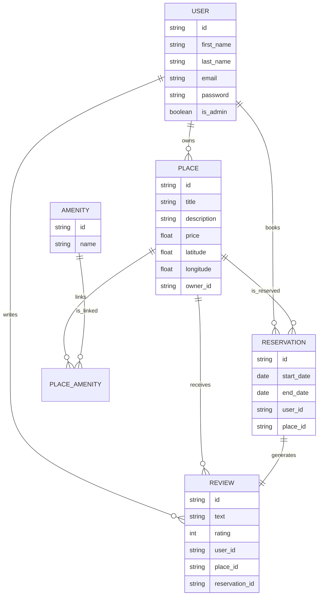

```mermaid
erDiagram
    USER {
        string id
        string first_name
        string last_name
        string email
        string password
        boolean is_admin
    }

    PLACE {
        string id
        string title
        string description
        float price
        float latitude
        float longitude
        string owner_id
    }

    REVIEW {
        string id
        string text
        int rating
        string user_id
        string place_id
        string reservation_id
    }

    AMENITY {
        string id
        string name
    }

    RESERVATION {
        string id
        date start_date
        date end_date
        string user_id
        string place_id
    }

    %% Relations
    USER ||--o{ PLACE : owns
    USER ||--o{ REVIEW : writes
    USER ||--o{ RESERVATION : books

    PLACE ||--o{ REVIEW : receives
    PLACE ||--o{ RESERVATION : is_reserved
    PLACE ||--o{ PLACE_AMENITY : links

    AMENITY ||--o{ PLACE_AMENITY : is_linked

    RESERVATION ||--|| REVIEW : generates

```
